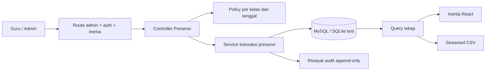

# Rencana Implementasi Sistem Absensi Siswa

> **Untuk pekerja agentik:** REQUIRED SUB-SKILL: gunakan `superpowers:subagent-driven-development` (direkomendasikan) atau `superpowers:executing-plans` untuk menjalankan rencana ini task demi task. Setiap langkah menggunakan checkbox (`- [ ]`) agar progres dapat dilacak.

**Goal:** Menambahkan absensi harian siswa yang cepat dipakai wali kelas, dapat dipantau dan direkap admin sekolah, serta aman dijalankan pada Laravel dan MySQL di hosting SMA yang sudah ada.

**Architecture:** Absensi dibangun sebagai modul privat di panel `/admin/*` yang sekarang, bukan aplikasi atau layanan terpisah. Wali kelas mengisi satu absensi per kelas per hari; admin mengelola data akademik, mengoreksi dengan alasan tercatat, memantau kelengkapan, dan mengekspor CSV. Seluruh perubahan penting berjalan dalam transaksi database, dibatasi policy, dan masuk riwayat audit.

**Tech Stack:** PHP 8.4.1, Laravel 13, MySQL 8 produksi, SQLite untuk test, Inertia 3, React 19, TypeScript strict, Tailwind CSS 4 dengan token semantik, spatie/laravel-permission 8.

**Spec:** Bagian I–XIV dokumen `PLAN-ABSENSI-SISWA.md` ini adalah spesifikasi desain yang menjadi dasar task implementasi pada Bagian XV.

## Global Constraints

- Baca `AGENTS.md`, `HANDOFF.md`, `AGENTS-SMA.md`, `PRD-SMA.md`, `docs/KONTEN-SEKOLAH.md`, dan `CHANGELOG.md` sebelum menyentuh kode.
- PHP Artisan wajib memakai `/Applications/MAMP/bin/php/php8.4.1/bin/php`.
- Produksi tetap Laravel + MySQL di shared hosting BiznetGio; jangan menambah Vercel, Supabase, Firebase, Redis, daemon queue, atau layanan berbayar baru.
- Situs publik tetap Blade + Alpine. Modul absensi hanya berada di panel Inertia + React dan middleware `inertia` tetap hanya pada grup rute admin.
- Seluruh UI, pesan validasi, ekspor, dan dokumentasi operasional memakai Bahasa Indonesia.
- Tidak ada dependency baru tanpa persetujuan pemilik proyek.
- Tidak ada nilai hex, kelas palet Tailwind, atau nilai warna arbitrer di luar `resources/css/app.css`.
- Dilarang menyimpan NIK, NUPTK, NISN, nomor KK, foto kartu keluarga, data orang tua, atau identitas kependudukan lain. MVP hanya memakai kode siswa internal sekolah.
- Zona waktu bisnis selalu `Asia/Jakarta`.
- Absensi tidak pernah otomatis mengubah siswa menjadi Alpa. Status hanya berasal dari tindakan pengguna yang berwenang.
- Data siswa nyata tidak boleh dimasukkan ke seeder, fixture Git, screenshot publik, atau log.
- Setiap task memakai TDD, menjaga kompatibilitas SQLite/MySQL, dan diakhiri verifikasi serta commit terpisah saat eksekusi.
- Gerbang akhir wajib bersih: PHPUnit, Pint, PHPStan level 5, TypeScript, test Node, build Vite, audit privasi/token, dan browser nyata pada 390px serta 1280px.

---

## Cara memakai dokumen ini di room baru

Mulai room baru dengan instruksi berikut:

> Baca `AGENTS.md` dan `PLAN-ABSENSI-SISWA.md` sampai selesai. Jangan ubah situs publik. Audit kondisi repo dan perubahan yang belum di-commit, lalu jalankan rencana absensi task demi task memakai TDD. Sebelum Task 1, tunjukkan hasil Decision Gate Task 0 dan minta persetujuan jika jawaban sekolah berbeda dari default aman di plan.

Dokumen ini tidak mengubah scope serah-terima website profil saat ini. `PRD-SMA.md` masih menempatkan presensi di luar scope sampai sekolah dan pemilik proyek menyetujui fase kedua secara tertulis.

# Bagian I — Keputusan produk

## 1. Bentuk MVP yang direkomendasikan

MVP adalah **absensi harian satu kali per kelas**, diisi wali kelas. Guru tidak mengeklik Hadir satu per satu: daftar dimulai dengan status `Belum diisi`, guru menekan **Tandai semua hadir**, lalu mengubah pengecualian menjadi Sakit, Izin, Alpa, atau Terlambat.

Admin sekolah:

- mengelola periode, kelas, siswa, keanggotaan kelas, wali kelas, dan akun guru;
- melihat kelas mana yang sudah atau belum menyelesaikan absensi pada tanggal yang dipilih;
- dapat mengisi sebagai pengganti wali kelas;
- dapat memperbaiki data lama dengan alasan wajib;
- melihat riwayat perubahan yang tidak dapat diedit;
- mengunduh rekap CSV per kelas, periode tanggal, dan siswa.

## 2. Yang tidak masuk MVP

- Absensi per mata pelajaran atau per jam pelajaran.
- Portal atau login wali siswa.
- Notifikasi WhatsApp otomatis.
- Surat izin/sakit dalam bentuk foto atau lampiran.
- Pengenalan wajah, sidik jari, QR siswa, GPS, atau geofencing.
- Mode offline/PWA dan sinkronisasi konflik antarperangkat.
- Penggajian, nilai, rapor, jadwal pelajaran, PPDB, atau sistem akademik penuh.
- PDF bergaya. CSV UTF-8 yang dapat dibuka Excel menjadi format ekspor pertama.
- Penghapusan otomatis data historis.

Semua butir tersebut membutuhkan spec dan anggaran terpisah. Jangan menyiapkan tabel atau abstraksi prematur untuk fitur-fitur itu.

## 3. Perbandingan pendekatan

| Pendekatan | Kelebihan | Kekurangan | Keputusan |
|---|---|---|---|
| Modul di Laravel SMA yang sama | Satu hosting, satu login, satu backup, satu panel, biaya tetap | Repo bertambah besar dan otorisasi harus disiplin | **Dipilih** |
| Aplikasi Laravel terpisah pada subdomain | Batas sistem kuat dan deploy terpisah | Dua login, dua backup, dua prosedur operasi | Ditolak untuk MVP |
| Next.js + Supabase/Vercel | Pengembangan UI cepat dan layanan terkelola | Dua stack, dua sumber data, billing serta handoff lebih rumit | Ditolak |
| Form/Spreadsheet manual | Cepat mulai tanpa pembangunan | Validasi, audit, akses, dan konsistensi lemah | Hanya cadangan operasional saat sistem bermasalah |

# Bagian II — Decision Gate sebelum implementasi

Task 0 wajib mencatat jawaban sekolah. Bila sekolah belum menjawab, gunakan default aman berikut agar plan tetap deterministik.

| Pertanyaan | Default aman di plan |
|---|---|
| Absensi harian atau per mata pelajaran? | Harian, satu kali per kelas |
| Pengisi utama? | Wali kelas; admin sebagai pengganti |
| Status yang dipakai? | Belum diisi, Hadir, Sakit, Izin, Alpa, Terlambat |
| Batas edit guru? | Hanya tanggal hari ini menurut Asia/Jakarta |
| Koreksi tanggal lampau? | Hanya admin, alasan wajib |
| Ekspor awal? | CSV UTF-8 per kelas dan rentang tanggal |
| Bukti surat izin/sakit? | Disimpan sekolah di luar sistem; sistem hanya mencatat status dan catatan singkat |
| Identitas siswa? | `kode_siswa` internal yang unik dan nama; tanpa NISN/NIK |
| Portal wali siswa? | Tidak ada pada MVP |
| Retensi data? | Tidak ada penghapusan otomatis; sekolah menetapkan kebijakan kemudian |
| Pilot? | Satu kelas selama lima hari sekolah sebelum rollout penuh |

Jika sekolah meminta absensi per mata pelajaran atau portal wali siswa, hentikan eksekusi plan ini. Keduanya mengubah model data, otorisasi, beban kerja, dan lingkup privasi secara material.

# Bagian III — Pengguna, peran, dan kewenangan

| Peran | Kewenangan absensi |
|---|---|
| `super-admin` | Seluruh akses melalui `Gate::before` yang sudah ada |
| `admin` | Mengelola periode/kelas/siswa, melihat semua kelas, mengisi atau mengoreksi semua absensi, melihat audit, mengekspor rekap |
| `guru` | Melihat dan mengisi kelas yang wali kelasnya adalah dirinya; melihat riwayat kelas sendiri; tidak mengelola siswa, akun, atau konten situs |

Akun `guru` wajib terhubung satu-ke-satu ke baris `guru` melalui `users.guru_id`. Akun admin dan super admin boleh memiliki `guru_id` kosong. Satu baris guru tidak boleh dipakai oleh dua akun.

Izin baru:

- `presensi.isi` — diberikan kepada peran guru dan admin.
- `presensi.kelola` — diberikan kepada admin; super admin tetap melewati pemeriksaan.

Policy tetap menjadi sumber kebenaran akses objek. Menyembunyikan menu React bukan pengamanan.

# Bagian IV — Alur utama

## 1. Pengisian oleh wali kelas

1. Guru login melalui `/login`.
2. Guru diarahkan ke `/admin/presensi`, bukan dasbor kesiapan website.
3. Sistem hanya menampilkan kelas yang memiliki `wali_kelas_id` sesuai `user.guru_id`.
4. Guru memilih kelas dan tanggal hari ini.
5. Sistem menampilkan roster yang keanggotaannya aktif pada tanggal tersebut.
6. Semua baris awal berstatus `Belum diisi`. Sistem tidak menganggap hadir secara diam-diam.
7. Guru menekan **Tandai semua hadir**, kemudian mengubah pengecualian.
8. **Simpan draf** mengizinkan status Belum diisi. **Selesaikan absensi** menolak jika masih ada baris Belum diisi.
9. Setelah selesai, guru masih dapat memperbaiki pada tanggal yang sama.
10. Setiap perubahan status masuk `riwayat_presensi`.

## 2. Penggantian dan koreksi oleh admin

1. Admin memilih tanggal pada monitor harian.
2. Semua kelas aktif ditampilkan dengan status Belum dibuat, Draf, atau Selesai.
3. Admin dapat mengisi kelas yang belum diisi.
4. Untuk tanggal lampau, admin wajib menulis alasan koreksi minimal 10 karakter.
5. Perubahan menyimpan aktor, waktu, nilai lama, nilai baru, dan alasan.

## 3. Rekap

1. Admin memilih periode akademik, kelas, tanggal awal, dan tanggal akhir.
2. Sistem menghitung jumlah Hadir, Terlambat, Sakit, Izin, dan Alpa per siswa.
3. Persentase kehadiran dihitung:

   `(Hadir + Terlambat) / jumlah sesi selesai × 100`

4. Draf dan hari tanpa sesi selesai tidak masuk penyebut.
5. CSV mengekspor data yang sama dengan layar dan menyertakan waktu pembuatan rekap dalam WIB.

# Bagian V — Arsitektur dan batas modul



Unit utama:

- **Controller:** orkestrasi HTTP dan pemetaan props; tidak memuat aturan bisnis rumit.
- **Form Request:** bentuk payload dan pesan validasi Bahasa Indonesia.
- **Policy:** siapa boleh melihat/mengubah kelas atau presensi tertentu.
- **Service/Action:** transaksi, roster, optimistic locking, finalisasi, dan audit.
- **Model/Query:** relasi dan query reusable.
- **React page:** interaksi form, aksesibilitas, responsif; bukan tempat keputusan otorisasi.
- **CSV exporter:** satu-satunya pembentuk file rekap dan pelindung formula injection.

# Bagian VI — Model data

## 1. `tahun_ajaran`

| Kolom | Tipe/aturan |
|---|---|
| `id` | primary key |
| `nama` | string 20, contoh `2026/2027` |
| `semester` | `ganjil` atau `genap` |
| `mulai_pada` | date |
| `selesai_pada` | date, harus setelah mulai |
| `aktif` | boolean |
| timestamps | standar Laravel |

Unique: `[nama, semester]`. Service aktivasi memastikan hanya satu periode aktif dalam transaksi.

## 2. `kelas`

| Kolom | Tipe/aturan |
|---|---|
| `id` | primary key |
| `tahun_ajaran_id` | FK restrict |
| `nama` | string 50 |
| `tingkat` | tiny integer 10–12 |
| `wali_kelas_id` | FK nullable ke `guru`, restrict |
| `aktif` | boolean |
| timestamps | standar Laravel |

Unique: `[tahun_ajaran_id, nama]`. Kelas yang sudah memiliki presensi tidak boleh dihapus; gunakan `aktif=false`.

## 3. `siswa`

| Kolom | Tipe/aturan |
|---|---|
| `id` | primary key |
| `kode_siswa` | string 30, unique, kode internal sekolah |
| `nama` | string 150 |
| `jenis_kelamin` | nullable `L`/`P` |
| `aktif` | boolean |
| timestamps | standar Laravel |

Tidak ada tanggal lahir, alamat rumah, data orang tua, NISN, NIK, atau identitas nasional.

## 4. `anggota_kelas`

| Kolom | Tipe/aturan |
|---|---|
| `id` | primary key |
| `kelas_id` | FK restrict |
| `siswa_id` | FK restrict |
| `mulai_pada` | date |
| `selesai_pada` | date nullable |
| timestamps | standar Laravel |

Index: `[kelas_id, mulai_pada, selesai_pada]` dan `[siswa_id, mulai_pada, selesai_pada]`. Service menolak rentang keanggotaan yang tumpang tindih dalam periode yang sama. Rentang tanggal menjaga histori ketika siswa pindah kelas.

## 5. `presensi`

| Kolom | Tipe/aturan |
|---|---|
| `id` | primary key |
| `kelas_id` | FK restrict |
| `tanggal` | date |
| `status` | `draf` atau `selesai` |
| `dicatat_oleh` | FK ke users, restrict |
| `versi` | unsigned integer, default 1 |
| `selesai_pada` | datetime nullable |
| timestamps | standar Laravel |

Unique: `[kelas_id, tanggal]`. `versi` dipakai untuk mendeteksi dua tab/perangkat yang mengedit data lama.

## 6. `kehadiran_siswa`

| Kolom | Tipe/aturan |
|---|---|
| `id` | primary key |
| `presensi_id` | FK cascade pada rollback parent; tidak ada route hapus produksi |
| `siswa_id` | FK restrict |
| `status` | enum aplikasi: belum_diisi/hadir/sakit/izin/alpa/terlambat |
| `catatan` | nullable string 255 |
| `diubah_oleh` | FK users, restrict |
| timestamps | standar Laravel |

Unique: `[presensi_id, siswa_id]`. Catatan wajib untuk Izin dan Sakit bila kebijakan sekolah kelak mengharuskannya; default MVP menjadikannya opsional.

## 7. `riwayat_presensi`

Tabel append-only tanpa route update/delete:

- `presensi_id`, `siswa_id` nullable untuk perubahan tingkat sesi, `user_id`;
- `aksi`: buat_draf, simpan_draf, selesaikan, ubah_status;
- `status_sebelum` dan `status_sesudah` nullable;
- `catatan_sebelum` dan `catatan_sesudah` nullable;
- `alasan` nullable untuk hari ini, wajib untuk koreksi lampau;
- `created_at` saja.

# Bagian VII — Konsistensi dan aturan bisnis

1. Tanggal presensi tidak boleh di masa depan.
2. Tanggal harus berada dalam rentang periode kelas.
3. Guru hanya boleh mengubah tanggal hari ini dan kelas yang ditugaskan.
4. Admin boleh mengubah tanggal lampau dengan alasan.
5. Payload siswa harus sama persis dengan roster pada tanggal tersebut; ID asing atau siswa yang sudah pindah ditolak.
6. Finalisasi menolak setiap status `belum_diisi`.
7. Tombol Tandai semua hadir hanya mengubah state di browser; server tetap menerima dan memvalidasi setiap baris.
8. Simpan memakai transaction + `lockForUpdate()`.
9. Client mengirim `versi`. Jika berbeda dari versi database, server memberi HTTP 409 dan pesan: “Data telah diubah pengguna lain. Muat ulang sebelum menyimpan.”
10. Setiap perubahan nilai membuat audit row dalam transaksi yang sama.
11. Tidak ada job background atau queue.
12. Tidak ada penghapusan presensi dari UI.

Kontrak service inti:

```php
final class SimpanPresensi
{
    /**
     * @param list<array{siswa_id:int,status:string,catatan:?string}> $baris
     */
    public function jalankan(
        User $aktor,
        Kelas $kelas,
        CarbonImmutable $tanggal,
        int $versi,
        array $baris,
        bool $selesaikan,
        ?string $alasan,
    ): Presensi;
}
```

# Bagian VIII — UI/UX

## 1. Navigasi

- Guru melihat: Dasbor/Absensi, Profil akun, Keluar.
- Admin melihat menu lama ditambah **Data Akademik**, **Absensi**, dan **Rekap Absensi**.
- Label peran di header harus menampilkan “Guru”, bukan fallback “Admin Sekolah”.

## 2. Halaman pengisian

Desktop memakai tabel ringkas. Ponsel 390px memakai kartu per siswa agar kontrol status tidak terpotong.

Setiap baris/kartu memuat:

- nomor urut dan nama;
- status berupa radio/select dengan teks lengkap;
- catatan singkat;
- indikator perubahan belum tersimpan.

Aksi sticky di bawah pada ponsel:

- Tandai semua hadir;
- Simpan draf;
- Selesaikan absensi.

Status tidak boleh dibedakan hanya dengan warna. Selalu ada teks dan `aria-label`. Fokus keyboard terlihat dan dialog konfirmasi finalisasi dapat dibatalkan.

## 3. Empty/error states

- Akun guru belum terhubung ke data guru: tampilkan instruksi menghubungi super admin.
- Guru belum ditugaskan sebagai wali kelas: tidak menampilkan data kelas lain.
- Kelas belum punya siswa: arahkan admin mengisi roster; guru hanya melihat pesan.
- Konflik versi: jangan menimpa; tampilkan tombol Muat ulang.
- Koneksi gagal: state form tetap berada di browser dan pengguna dapat mencoba Simpan lagi.
- Tanggal lampau untuk guru: tampilkan read-only dengan penjelasan.

# Bagian IX — Import siswa

Admin dapat menambah siswa manual atau mengimpor CSV maksimal 2 MB. Template:

```csv
kode_siswa,nama,jenis_kelamin,kelas
AI-2026-001,Contoh Nama Siswa,L,X-A
```

Baris contoh hanya berada di template dokumentasi, bukan seeder produksi.

Alur import:

1. Upload dan baca dengan `fgetcsv`; tidak menambah paket Excel.
2. Tolak file bukan UTF-8 atau header yang berbeda.
3. Tolak header sensitif seperti `nik`, `nisn`, `nuptk`, `kk`, atau data orang tua.
4. Tampilkan preview valid/gagal sebelum commit.
5. Setelah konfirmasi, upsert berdasarkan `kode_siswa` dan buat keanggotaan kelas dalam satu transaksi.
6. Jika satu baris gagal, seluruh import dibatalkan dan pengguna mendapat nomor baris serta alasan.

# Bagian X — Rekap dan ekspor

Filter:

- periode akademik;
- kelas;
- tanggal awal/akhir dalam periode;
- pencarian nama/kode siswa.

Layar menampilkan count status dan persentase kehadiran. CSV memakai `StreamedResponse`, UTF-8 BOM, nama berkas `rekap-absensi-<kelas>-<awal>-<akhir>.csv`, serta mencegah formula injection dengan memberi awalan apostrof pada nilai yang dimulai `=`, `+`, `-`, atau `@`.

Tidak ada data siswa di route publik, sitemap, JSON-LD, atau response yang bisa diakses tanpa login.

# Bagian XI — Keamanan dan privasi

- Seluruh route absensi berada di middleware `auth` + `inertia`.
- Setiap controller memakai middleware izin; setiap objek memakai policy.
- Test wajib mencoba ID kelas, siswa, presensi, dan URL hasil tebakan dari guru lain.
- Request tidak mempercayai `kelas_id` atau `siswa_id` tanpa mencocokkan roster.
- CSRF dan session auth memakai mekanisme Laravel yang sudah ada.
- Export hanya admin; nama file tidak mengambil input mentah.
- Audit tidak menyimpan password, cookie, IP lengkap, user agent, atau payload request.
- Log aplikasi tidak mencetak roster atau isi absensi.
- Backup database mengikuti backup hosting dan `spatie/laravel-backup`; restore diuji sebelum rollout.
- Data produksi tidak digunakan untuk screenshot dokumentasi. Gunakan factory dengan nama jelas fiktif pada test.

# Bagian XII — Operasional

- Satu transaksi pengisian kelas berisi sekitar 20–50 baris; skala sekolah tidak memerlukan queue atau cache eksternal.
- Index unique dan foreign key menjadi perlindungan utama terhadap duplikasi.
- Admin menyiapkan periode, kelas, wali kelas, dan roster sebelum tanggal mulai.
- Minimal dua super/admin sekolah memegang akun pemulihan.
- Akun guru dibuat dengan email individual; akun bersama seperti `guru@...` dilarang karena audit kehilangan makna.
- Jika sistem tidak bisa diakses, sekolah memakai lembar manual hari itu. Admin memasukkan kembali data setelah layanan pulih dengan alasan “Pemulihan dari lembar manual”.

# Bagian XIII — Kriteria penerimaan

MVP diterima bila:

1. Wali kelas dapat menyelesaikan kelas 40 siswa dalam waktu target maksimal dua menit setelah roster tampil.
2. Guru tidak dapat melihat atau mengubah kelas guru lain.
3. Tidak ada status Alpa yang terbentuk otomatis.
4. Dua tab yang menyimpan versi berbeda tidak saling menimpa.
5. Admin dapat melihat status seluruh kelas pada tanggal tertentu.
6. Koreksi lampau tanpa alasan ditolak.
7. Audit menunjukkan siapa, kapan, siswa mana, serta nilai lama dan baru.
8. Rekap layar dan CSV menghasilkan angka sama.
9. CSV aman dari formula injection.
10. Ponsel 390px tidak memiliki horizontal overflow pada workflow utama.
11. Public website tetap tidak memuat React atau data absensi.
12. Backup dan restore sampel berhasil.

# Bagian XIV — Rollout dan estimasi

Urutan rollout:

1. Konfirmasi Decision Gate dan tanda tangan addendum scope.
2. Implementasi serta QA dengan data factory.
3. Import data resmi melalui admin, bukan lewat Git.
4. Pelatihan admin dan wali kelas.
5. Pilot satu kelas selama lima hari sekolah.
6. Evaluasi waktu pengisian, kesalahan, dan koreksi.
7. Rollout seluruh kelas.
8. Review setelah satu bulan.

Perkiraan kerja: **8–12 hari pengembangan fokus**, di luar lima hari pilot dan perbaikan hasil pilot. Sistem absensi adalah fase berbayar/addendum terpisah dari biaya domain, hosting, website profil, dan maintenance yang sudah disepakati.

# Bagian XV — Implementation Plan

## Peta file

### File baru

- `app/Enums/StatusKehadiran.php` — nilai dan label status siswa.
- `app/Enums/StatusPresensi.php` — draf/selesai.
- `app/Models/TahunAjaran.php`, `Kelas.php`, `Siswa.php`, `AnggotaKelas.php`, `Presensi.php`, `KehadiranSiswa.php`, `RiwayatPresensi.php`.
- Factory untuk setiap model akademik di `database/factories/`.
- Tujuh migrasi akademik/presensi dan satu migrasi `users.guru_id`.
- `app/Policies/PresensiPolicy.php` dan policy master data bila diperlukan.
- Form Request akademik/presensi di `app/Http/Requests/`.
- Controller admin: `TahunAjaranController`, `KelasController`, `SiswaController`, `ImporSiswaController`, `PresensiController`, `RekapPresensiController`.
- Service: `AktifkanTahunAjaran`, `KelolaKeanggotaanKelas`, `ImporSiswaCsv`, `SimpanPresensi`, `RekapPresensi`, `EksporRekapPresensiCsv`.
- Exception `app/Exceptions/KonflikVersiPresensi.php`.
- Halaman React pada `resources/js/Pages/DataAkademik/`, `Presensi/`, dan `RekapPresensi/`.
- Test fitur terpisah per area di `tests/Feature/Presensi/`.
- `docs/PANDUAN-ABSENSI.md` untuk admin/guru.

### File yang dimodifikasi

- `app/Enums/Peran.php`, `app/Enums/Izin.php`, `database/seeders/PeranSeeder.php`.
- `app/Models/User.php`, `app/Models/Guru.php`, `app/Providers/AppServiceProvider.php`.
- `app/Http/Controllers/Admin/PenggunaController.php` dan `app/Console/Commands/BuatPengguna.php`.
- `app/Http/Controllers/Admin/DasborController.php`.
- `app/Http/Middleware/HandleInertiaRequests.php`.
- `routes/web.php`.
- `resources/js/types.d.ts`, `resources/js/nav-admin.ts`, `resources/js/Layouts/Layout.tsx`, `resources/js/Components/Ui.tsx`.
- `PRD-SMA.md`, `AGENTS-SMA.md`, `HANDOFF.md`, `CHANGELOG.md`.

---

### Task 0: Konfirmasi scope dan baseline

**Files:**
- Modify: `PRD-SMA.md`
- Modify: `AGENTS-SMA.md`
- Modify: `HANDOFF.md`
- Modify: `CHANGELOG.md`

**Interfaces:**
- Consumes: Decision Gate pada Bagian II.
- Produces: scope MVP tertulis yang mengizinkan Task 1–14.

- [ ] **Step 1: Catat jawaban sekolah dalam issue/nota proyek**

Gunakan tabel Bagian II dan simpan keputusan yang berbeda dari default. Jangan menyalin data siswa pada tahap ini.

- [ ] **Step 2: Perbarui PRD dan ADR**

Pindahkan absensi harian dari Non-Goals ke fase kedua P0 tersendiri. Pertahankan absensi per mapel dan portal wali sebagai Non-Goals. Tambahkan ADR bahwa modul tetap berada pada Laravel/MySQL yang sama.

- [ ] **Step 3: Perbarui aturan privasi**

Tambahkan larangan eksplisit NISN dan data orang tua pada `AGENTS-SMA.md` tanpa mengurangi larangan NIK/NUPTK.

- [ ] **Step 4: Verifikasi scope**

Run:

```bash
rg -n "presensi|absensi|NISN|wali siswa" PRD-SMA.md AGENTS-SMA.md HANDOFF.md
```

Expected: scope harian jelas; per-mapel dan portal wali tetap di luar MVP; tidak ada kontradiksi.

- [ ] **Step 5: Commit**

```bash
git add PRD-SMA.md AGENTS-SMA.md HANDOFF.md CHANGELOG.md
git commit -m "docs: sepakati scope absensi harian"
```

---

### Task 1: Enum, skema, model, dan factory

**Files:**
- Create: seluruh enum/model/factory dan migrasi pada Peta File.
- Modify: `app/Models/User.php`
- Modify: `app/Models/Guru.php`
- Test: `tests/Feature/Presensi/SkemaPresensiTest.php`

**Interfaces:**
- Produces: model dan relasi yang dipakai seluruh task berikutnya.

- [ ] **Step 1: Tulis test skema yang gagal**

Test harus membuktikan:

```php
public function test_satu_kelas_hanya_punya_satu_presensi_per_tanggal(): void
{
    $kelas = Kelas::factory()->create();
    Presensi::factory()->create(['kelas_id' => $kelas->id, 'tanggal' => '2026-08-24']);

    $this->expectException(QueryException::class);
    Presensi::factory()->create(['kelas_id' => $kelas->id, 'tanggal' => '2026-08-24']);
}
```

Tambahkan test unique kode siswa, satu kehadiran per siswa/presensi, cast enum, relasi, dan foreign-key restrict.

- [ ] **Step 2: Jalankan test dan pastikan gagal**

```bash
/Applications/MAMP/bin/php/php8.4.1/bin/php artisan test tests/Feature/Presensi/SkemaPresensiTest.php
```

Expected: gagal karena tabel/model belum ada.

- [ ] **Step 3: Buat enum**

```php
enum StatusKehadiran: string
{
    case BelumDiisi = 'belum_diisi';
    case Hadir = 'hadir';
    case Sakit = 'sakit';
    case Izin = 'izin';
    case Alpa = 'alpa';
    case Terlambat = 'terlambat';
}

enum StatusPresensi: string
{
    case Draf = 'draf';
    case Selesai = 'selesai';
}
```

Keduanya wajib mempunyai method `label(): string` berbahasa Indonesia.

- [ ] **Step 4: Buat migrasi sesuai Bagian VI**

Gunakan `foreignId()->constrained(...)->restrictOnDelete()` untuk data master/historis dan index yang sudah ditentukan. Migrasi `users.guru_id` memakai nullable unique FK.

- [ ] **Step 5: Buat model, relasi, scopes, factory, dan PHPDoc**

Scope penting:

```php
public function scopeAktifPada(Builder $query, CarbonInterface $tanggal): Builder
{
    return $query
        ->whereDate('mulai_pada', '<=', $tanggal)
        ->where(fn (Builder $q) => $q
            ->whereNull('selesai_pada')
            ->orWhereDate('selesai_pada', '>=', $tanggal));
}
```

- [ ] **Step 6: Jalankan test dan analisis statis**

Run test Task 1, Pint, dan PHPStan. Expected: semua bersih.

- [ ] **Step 7: Commit**

```bash
git add app/Enums app/Models database/migrations database/factories tests/Feature/Presensi/SkemaPresensiTest.php
git commit -m "feat: tambah fondasi data absensi"
```

---

### Task 2: Peran guru, izin, dan hubungan akun

**Files:**
- Modify: `app/Enums/Peran.php`
- Modify: `app/Enums/Izin.php`
- Modify: `database/seeders/PeranSeeder.php`
- Modify: `app/Http/Controllers/Admin/PenggunaController.php`
- Modify: `app/Console/Commands/BuatPengguna.php`
- Modify: `resources/js/Pages/Pengguna/Form.tsx`
- Modify: `resources/js/Pages/Pengguna/Index.tsx`
- Modify: `resources/js/types.d.ts`
- Test: `tests/Feature/Presensi/PeranGuruTest.php`

**Interfaces:**
- Consumes: `User::guru()` dari Task 1.
- Produces: `Peran::Guru`, `Izin::IsiPresensi`, `Izin::KelolaPresensi`.

- [ ] **Step 1: Tulis test izin dan validasi akun**

Test: guru hanya memiliki `presensi.isi`; admin memiliki isi+kelola; guru wajib memilih baris pendidik aktif; satu guru tidak dapat dihubungkan ke dua akun; perubahan peran dari guru melepaskan/menolak `guru_id` sesuai kontrak.

- [ ] **Step 2: Jalankan dan pastikan gagal**

- [ ] **Step 3: Implementasikan enum dan seeder idempoten**

```php
case Guru = 'guru';
case IsiPresensi = 'presensi.isi';
case KelolaPresensi = 'presensi.kelola';
```

Tambahkan `Izin::untukGuru()` dan jangan memberi daftar izin eksplisit kepada super admin.

- [ ] **Step 4: Perbarui pembuatan akun**

Form menampilkan pilihan guru hanya saat peran `guru`. Server tetap memvalidasi karena menyembunyikan field bukan keamanan. CLI menambah opsi `--guru-id` khusus peran guru.

- [ ] **Step 5: Jalankan test Task 2, test akun lama, tsc, Pint, PHPStan**

- [ ] **Step 6: Commit**

```bash
git add app/Enums app/Models/User.php database/seeders/PeranSeeder.php app/Http/Controllers/Admin/PenggunaController.php app/Console/Commands/BuatPengguna.php resources/js/Pages/Pengguna resources/js/types.d.ts tests/Feature/Presensi/PeranGuruTest.php
git commit -m "feat: tambah akun dan izin guru"
```

---

### Task 3: Policy dan penjagaan akses per kelas

**Files:**
- Create: `app/Policies/PresensiPolicy.php`
- Modify: `app/Providers/AppServiceProvider.php` bila discovery policy perlu eksplisit
- Test: `tests/Feature/Presensi/OtorisasiPresensiTest.php`

**Interfaces:**
- Consumes: user-guru dan kelas-wali dari Task 1–2.
- Produces: ability `view`, `save`, `correct`, `export`.

- [ ] **Step 1: Tulis matriks test akses**

Kasus minimum: guru sendiri boleh hari ini; guru lain 403; guru tanpa `guru_id` 403; guru tidak boleh tanggal lampau; admin boleh semua kelas; admin koreksi lampau; pengguna tanpa izin 403; super admin lolos.

- [ ] **Step 2: Jalankan dan pastikan gagal**

- [ ] **Step 3: Implementasikan policy**

```php
public function save(User $user, Kelas $kelas, CarbonImmutable $tanggal): bool
{
    if ($user->can(Izin::KelolaPresensi->value)) {
        return true;
    }

    return $tanggal->isToday()
        && $user->can(Izin::IsiPresensi->value)
        && $user->guru_id !== null
        && $kelas->wali_kelas_id === $user->guru_id;
}
```

Gunakan tanggal ber-timezone Asia/Jakarta, bukan timezone browser.

- [ ] **Step 4: Jalankan test dan PHPStan**

- [ ] **Step 5: Commit**

```bash
git add app/Policies app/Providers/AppServiceProvider.php tests/Feature/Presensi/OtorisasiPresensiTest.php
git commit -m "feat: batasi absensi per wali kelas"
```

---

### Task 4: CRUD periode, kelas, siswa, dan keanggotaan

**Files:**
- Create: controller, request, dan page `DataAkademik` pada Peta File.
- Modify: `routes/web.php`
- Modify: `resources/js/nav-admin.ts`
- Test: `tests/Feature/Presensi/DataAkademikTest.php`

**Interfaces:**
- Consumes: model Task 1 dan izin `presensi.kelola`.
- Produces: data roster valid bagi Task 5.

- [ ] **Step 1: Tulis test CRUD dan invariant**

Test validasi tanggal periode, tingkat 10–12, satu periode aktif, wali harus pendidik aktif, rentang anggota tidak tumpang tindih, dan kelas/periode berhistori tidak dapat dihapus.

- [ ] **Step 2: Jalankan dan pastikan gagal**

- [ ] **Step 3: Implementasikan Form Request dan service keanggotaan**

Method service:

```php
public function pindahkan(
    Siswa $siswa,
    Kelas $tujuan,
    CarbonImmutable $mulai,
): AnggotaKelas;
```

Service menutup keanggotaan lama sehari sebelum `mulai` dan tidak mengubah histori presensi.

- [ ] **Step 4: Implementasikan controller tipis dan route**

Semua route master memakai `can:presensi.kelola`.

- [ ] **Step 5: Implementasikan UI responsif**

Gunakan primitif `Ui.tsx`, Bahasa Indonesia, empty state, dan token semantik.

- [ ] **Step 6: Jalankan test, tsc, Pint, PHPStan**

- [ ] **Step 7: Commit**

```bash
git add app/Http/Controllers/Admin app/Http/Requests app/Services resources/js/Pages/DataAkademik resources/js/nav-admin.ts routes/web.php tests/Feature/Presensi/DataAkademikTest.php
git commit -m "feat: kelola data akademik absensi"
```

---

### Task 5: Import CSV siswa yang aman

**Files:**
- Create: `app/Services/ImporSiswaCsv.php`
- Create: `app/Http/Controllers/Admin/ImporSiswaController.php`
- Create: `app/Http/Requests/ImporSiswaRequest.php`
- Create: `resources/js/Pages/DataAkademik/ImporSiswa.tsx`
- Test: `tests/Feature/Presensi/ImporSiswaTest.php`

**Interfaces:**
- Produces: preview dan commit import berdasarkan kode internal.

- [ ] **Step 1: Tulis test parser dan transaksi**

Test header valid, UTF-8, duplikat kode, kelas tidak ditemukan, gender invalid, header sensitif ditolak, nomor baris error, preview tidak menulis DB, dan commit all-or-nothing.

- [ ] **Step 2: Jalankan dan pastikan gagal**

- [ ] **Step 3: Implementasikan parser native**

Kontrak:

```php
/** @return array{valid:list<BarisImporSiswa>, error:list<GalatImpor>} */
public function pratinjau(UploadedFile $file, TahunAjaran $periode): array;
```

Jangan menyimpan file upload setelah request selesai.

- [ ] **Step 4: Implementasikan preview dan konfirmasi**

Kirim token import bertanda tangan/session, bukan path file dari pengguna.

- [ ] **Step 5: Jalankan test dan audit privasi**

```bash
rg -n -i "\b(nik|nuptk|nisn|nomor_kk)\b" app resources database tests/Feature/Presensi
```

Expected: hanya larangan/test yang disengaja; tidak ada field penyimpanan.

- [ ] **Step 6: Commit**

```bash
git add app/Services/ImporSiswaCsv.php app/Http/Controllers/Admin/ImporSiswaController.php app/Http/Requests/ImporSiswaRequest.php resources/js/Pages/DataAkademik/ImporSiswa.tsx tests/Feature/Presensi/ImporSiswaTest.php
git commit -m "feat: impor roster siswa dari csv"
```

---

### Task 6: Service penyimpanan presensi dan audit

**Files:**
- Create: `app/Services/SimpanPresensi.php`
- Create: `app/Exceptions/KonflikVersiPresensi.php`
- Test: `tests/Feature/Presensi/SimpanPresensiTest.php`

**Interfaces:**
- Consumes: signature pada Bagian VII.
- Produces: transaksi atomik yang dipakai controller.

- [ ] **Step 1: Tulis failing tests aturan inti**

Cakup draf, finalisasi, roster persis, larangan future date, admin koreksi lampau+alasan, guru hari ini, audit, rollback saat satu baris invalid, dan increment versi.

- [ ] **Step 2: Tulis test konflik dua editor**

Editor A dan B membaca versi 1. A menyimpan menjadi versi 2. B mengirim versi 1 dan harus menerima `KonflikVersiPresensi` tanpa perubahan database.

- [ ] **Step 3: Jalankan dan pastikan gagal**

- [ ] **Step 4: Implementasikan transaksi**

Gunakan `DB::transaction`, `lockForUpdate`, diff sebelum update, `upsert` per baris, audit dalam transaksi sama, dan increment versi terakhir.

- [ ] **Step 5: Jalankan test, Pint, PHPStan**

- [ ] **Step 6: Commit**

```bash
git add app/Services/SimpanPresensi.php app/Exceptions/KonflikVersiPresensi.php tests/Feature/Presensi/SimpanPresensiTest.php
git commit -m "feat: simpan absensi atomik dan teraudit"
```

---

### Task 7: Endpoint dan validasi pengisian

**Files:**
- Create: `app/Http/Requests/SimpanPresensiRequest.php`
- Create: `app/Http/Controllers/Admin/PresensiController.php`
- Modify: `routes/web.php`
- Test: `tests/Feature/Presensi/EndpointPresensiTest.php`

**Interfaces:**
- Consumes: `SimpanPresensi::jalankan`.
- Produces: props Inertia dan endpoint PUT.

- [ ] **Step 1: Tulis test HTTP**

Route:

```php
Route::get('presensi', [PresensiController::class, 'index'])->name('presensi.index');
Route::get('presensi/{kelas}/{tanggal}', [PresensiController::class, 'edit'])->name('presensi.edit');
Route::put('presensi/{kelas}/{tanggal}', [PresensiController::class, 'update'])->name('presensi.update');
```

Test 200/403/422/409, pesan Bahasa Indonesia, future date, IDOR siswa, draf, selesai, dan koreksi.

- [ ] **Step 2: Jalankan dan pastikan gagal**

- [ ] **Step 3: Implementasikan request dan controller**

GET tidak membuat data. PUT pertama membuat sesi dalam transaksi. Props tidak menyertakan field pribadi selain kode internal, nama, status, dan catatan.

- [ ] **Step 4: Jalankan test**

- [ ] **Step 5: Commit**

```bash
git add app/Http/Requests/SimpanPresensiRequest.php app/Http/Controllers/Admin/PresensiController.php routes/web.php tests/Feature/Presensi/EndpointPresensiTest.php
git commit -m "feat: buka endpoint pengisian absensi"
```

---

### Task 8: UI pengisian guru

**Files:**
- Create: `resources/js/Pages/Presensi/Index.tsx`
- Create: `resources/js/Pages/Presensi/Form.tsx`
- Create: `resources/js/Pages/Presensi/StatusKehadiran.tsx`
- Modify: `resources/js/Components/Ui.tsx` bila primitif baru benar-benar reusable.
- Modify: `resources/js/nav-admin.ts`
- Test: `tests/js/presensi-form.test.ts` untuk fungsi state murni.

**Interfaces:**
- Consumes: props dan endpoint Task 7.
- Produces: workflow 390px/desktop.

- [ ] **Step 1: Ekstrak fungsi state murni dan tulis test**

```ts
export function tandaiSemuaHadir(baris: BarisPresensi[]): BarisPresensi[] {
    return baris.map((item) => ({ ...item, status: 'hadir' }));
}
```

Test tidak memutasi array sumber dan mempertahankan catatan.

- [ ] **Step 2: Jalankan test Node dan pastikan gagal**

- [ ] **Step 3: Implementasikan halaman**

Gunakan `useForm`, tombol draf/final, konfirmasi final, indikator belum tersimpan, state konflik, dan `beforeunload` hanya ketika ada perubahan lokal.

- [ ] **Step 4: Pastikan aksesibilitas**

Radio/select memiliki label nama siswa, error memakai `role="alert"`, status penyimpanan memakai `role="status"`, dan fokus dipindahkan ke ringkasan error saat 422.

- [ ] **Step 5: Jalankan test Node, tsc, build**

- [ ] **Step 6: Verifikasi browser**

Pada 390×844 dan 1280×900: Tandai semua hadir, ubah satu Izin, simpan draf, reload, selesaikan, dan cek tidak ada overflow/error console.

- [ ] **Step 7: Commit**

```bash
git add resources/js/Pages/Presensi resources/js/Components/Ui.tsx resources/js/nav-admin.ts tests/js/presensi-form.test.ts
git commit -m "feat: tambah antarmuka absensi guru"
```

---

### Task 9: Dasbor role-aware dan monitor harian

**Files:**
- Modify: `app/Http/Controllers/Admin/DasborController.php`
- Modify: `app/Http/Middleware/HandleInertiaRequests.php`
- Modify: `resources/js/Layouts/Layout.tsx`
- Modify: `resources/js/Pages/Dasbor.tsx`
- Create: `resources/js/Pages/Presensi/HariIni.tsx` bila monitor dipisah.
- Test: `tests/Feature/Presensi/DasborPresensiTest.php`

**Interfaces:**
- Produces: guru diarahkan ke absensi; admin melihat status semua kelas.

- [ ] **Step 1: Tulis test role-aware**

Guru login diarahkan ke `admin.presensi.index`; admin tetap melihat kesiapan situs dan ringkasan presensi; label header menampilkan Guru/Admin Sekolah/Super Admin dengan benar.

- [ ] **Step 2: Jalankan dan pastikan gagal**

- [ ] **Step 3: Implementasikan query monitor**

Gunakan satu query aggregate, bukan query per kelas. Status hanya Belum dibuat, Draf, atau Selesai.

- [ ] **Step 4: Implementasikan UI**

Tidak ada notifikasi eksternal atau asumsi hari libur. Monitor selalu mengikuti tanggal yang dipilih pengguna.

- [ ] **Step 5: Jalankan test, tsc, PHPStan**

- [ ] **Step 6: Commit**

```bash
git add app/Http/Controllers/Admin/DasborController.php app/Http/Middleware/HandleInertiaRequests.php resources/js/Layouts/Layout.tsx resources/js/Pages/Dasbor.tsx resources/js/Pages/Presensi tests/Feature/Presensi/DasborPresensiTest.php
git commit -m "feat: tampilkan monitor absensi harian"
```

---

### Task 10: Rekap dan CSV

**Files:**
- Create: `app/Services/RekapPresensi.php`
- Create: `app/Services/EksporRekapPresensiCsv.php`
- Create: `app/Http/Controllers/Admin/RekapPresensiController.php`
- Create: `resources/js/Pages/RekapPresensi/Index.tsx`
- Modify: `routes/web.php`
- Modify: `resources/js/nav-admin.ts`
- Test: `tests/Feature/Presensi/RekapPresensiTest.php`

**Interfaces:**
- Produces: data layar dan CSV dari query yang sama.

- [ ] **Step 1: Tulis test hitungan**

Pastikan Terlambat dihitung hadir dalam persentase tetapi tetap punya kolom sendiri; draf tidak masuk penyebut; filter kelas/tanggal bekerja.

- [ ] **Step 2: Tulis test keamanan CSV**

Nama `=HYPERLINK(...)` harus keluar sebagai `'=HYPERLINK(...)`, response hanya dapat diakses admin, content type dan nama file benar.

- [ ] **Step 3: Jalankan dan pastikan gagal**

- [ ] **Step 4: Implementasikan query dan exporter**

Controller tidak menghitung ulang. Layar dan exporter memanggil `RekapPresensi` yang sama.

- [ ] **Step 5: Implementasikan UI filter**

Filter masuk query string agar dapat dibookmark/reload, dengan empty state ketika belum ada sesi selesai.

- [ ] **Step 6: Jalankan test, tsc, build**

- [ ] **Step 7: Commit**

```bash
git add app/Services/RekapPresensi.php app/Services/EksporRekapPresensiCsv.php app/Http/Controllers/Admin/RekapPresensiController.php resources/js/Pages/RekapPresensi resources/js/nav-admin.ts routes/web.php tests/Feature/Presensi/RekapPresensiTest.php
git commit -m "feat: tambah rekap dan ekspor absensi"
```

---

### Task 11: Tampilan riwayat audit

**Files:**
- Add method/route read-only pada `PresensiController` atau controller `RiwayatPresensiController`.
- Create: `resources/js/Pages/Presensi/Riwayat.tsx`
- Test: `tests/Feature/Presensi/RiwayatPresensiTest.php`

**Interfaces:**
- Consumes: audit Task 6.
- Produces: audit read-only untuk admin dan wali kelas pemilik.

- [ ] **Step 1: Tulis test bahwa audit append-only**

Tidak ada route update/delete; guru lain 403; admin dapat melihat alasan koreksi dan nilai lama/baru.

- [ ] **Step 2: Implementasikan controller dan UI timeline sederhana**

Jangan tampilkan IP, user agent, atau payload mentah.

- [ ] **Step 3: Jalankan test dan browser check**

- [ ] **Step 4: Commit**

```bash
git add app/Http/Controllers/Admin resources/js/Pages/Presensi/Riwayat.tsx routes/web.php tests/Feature/Presensi/RiwayatPresensiTest.php
git commit -m "feat: tampilkan riwayat perubahan absensi"
```

---

### Task 12: Hardening, performa, dan privasi

**Files:**
- Test: `tests/Feature/Presensi/KeamananPresensiTest.php`
- Modify: hanya file temuan yang relevan.

**Interfaces:**
- Produces: bukti IDOR, query, privasi, dan concurrency aman.

- [ ] **Step 1: Tulis test serangan objek**

Uji menebak ID kelas, siswa, presensi, export, dan audit. Uji mass assignment field `dicatat_oleh`/`diubah_oleh` ditolak.

- [ ] **Step 2: Tulis batas query**

Gunakan `DB::enableQueryLog()` pada roster 40 siswa dan tetapkan batas yang membuktikan tidak ada N+1, misalnya maksimal 12 query untuk membuka form.

- [ ] **Step 3: Audit data sensitif**

```bash
rg -n -i "\b(nik|nuptk|nisn|nomor_kk|kartu keluarga)\b" app resources database
rg -n "[0-9]{16}" app resources database
```

Expected: nol field/data; komentar larangan boleh disesuaikan agar audit eksplisit tidak menghasilkan false positive sesuai aturan repo.

- [ ] **Step 4: Audit token dan batas render**

Pastikan tidak ada warna keras di TSX/Blade dan tidak ada React baru di entry publik.

- [ ] **Step 5: Jalankan seluruh suite**

- [ ] **Step 6: Commit**

```bash
git add tests/Feature/Presensi app resources database
git commit -m "test: perketat keamanan modul absensi"
```

---

### Task 13: Dokumentasi operasional dan training

**Files:**
- Create: `docs/PANDUAN-ABSENSI.md`
- Modify: `HANDOFF.md`
- Modify: `AGENTS-SMA.md`
- Modify: `CHANGELOG.md`

**Interfaces:**
- Produces: panduan manusia untuk serah terima.

- [ ] **Step 1: Tulis panduan admin**

Mencakup membuat periode/kelas, menghubungkan guru, import siswa, koreksi, rekap, dan pemulihan dari lembar manual.

- [ ] **Step 2: Tulis panduan guru**

Mencakup login, Tandai semua hadir, pengecualian, draf, finalisasi, koreksi hari yang sama, dan logout.

- [ ] **Step 3: Tambahkan SOP keamanan**

Tidak berbagi akun, tidak mengirim password lewat grup, logout pada perangkat bersama, dan melapor bila akun diduga bocor.

- [ ] **Step 4: Self-review dokumentasi**

Cari dan hilangkan placeholder/kontradiksi:

```bash
rg -n "TBD|TODO|nanti diisi|placeholder" docs/PANDUAN-ABSENSI.md HANDOFF.md AGENTS-SMA.md
```

Expected: nol hasil.

- [ ] **Step 5: Commit**

```bash
git add docs/PANDUAN-ABSENSI.md HANDOFF.md AGENTS-SMA.md CHANGELOG.md
git commit -m "docs: tambah panduan operasional absensi"
```

---

### Task 14: Deploy, pilot, dan acceptance

**Files:**
- Modify: `CHANGELOG.md`
- Tidak ada data siswa produksi di Git.

**Interfaces:**
- Produces: modul siap pilot satu kelas.

- [ ] **Step 1: Jalankan full quality gates**

```bash
/Applications/MAMP/bin/php/php8.4.1/bin/php artisan test
./vendor/bin/pint
./vendor/bin/phpstan analyse --memory-limit=512M
./node_modules/.bin/tsc --noEmit
npm run test:js
./node_modules/.bin/vite build
git diff --check
```

Expected: seluruhnya exit 0; catat jumlah test/asersi/modul aktual di CHANGELOG.

- [ ] **Step 2: Uji browser nyata**

Pada 390×844 dan 1280×900, jalankan alur guru serta admin lengkap. Konsol normal nol error/warning, fokus terlihat, dan tidak ada overflow.

- [ ] **Step 3: Uji migrate dari produksi lama**

Salin database yang sudah dianonimkan atau gunakan snapshot struktur tanpa data personal. Jalankan `php artisan migrate --force`; jangan mengandalkan `migrate:fresh` saja.

- [ ] **Step 4: Backup sebelum deploy**

Buat backup database dan uji restore pada database terpisah.

- [ ] **Step 5: Deploy kode tanpa data siswa**

```bash
git pull
composer install --no-dev --optimize-autoloader
php artisan migrate --force
php artisan config:cache
php artisan route:cache
php artisan view:cache
```

- [ ] **Step 6: Buat akun dan import melalui UI**

Gunakan akun individual dan file CSV resmi yang tidak pernah di-commit.

- [ ] **Step 7: Pilot satu kelas selama lima hari**

Catat waktu pengisian, jumlah koreksi, kendala login, ketepatan CSV, dan masukan guru. Jangan melakukan rollout ke semua kelas sebelum kriteria penerimaan pada Bagian XIII terpenuhi.

- [ ] **Step 8: Catat hasil dan commit final**

```bash
git add CHANGELOG.md public/build
git commit -m "chore: siapkan rilis pilot absensi"
```

# Bagian XVI — Definition of Done

- [ ] Decision Gate terdokumentasi dan tidak mengubah sistem menjadi absensi per mapel.
- [ ] Peran guru serta policy per kelas terbukti dengan test IDOR.
- [ ] Master data dan import tidak menyimpan identitas nasional.
- [ ] Draf/final/koreksi/audit/concurrency semuanya teruji.
- [ ] Layar guru cepat pada ponsel dan tidak mengharuskan klik Hadir satu per satu.
- [ ] Admin dapat memantau, mengoreksi dengan alasan, dan mengekspor CSV.
- [ ] Public Blade tetap ringan dan tidak mengekspos data absensi.
- [ ] Backup/restore berhasil.
- [ ] Pilot satu kelas selesai dan hasilnya dicatat.
- [ ] Dokumentasi serta CHANGELOG mutakhir.

# Catatan untuk pengembangan setelah MVP

Fitur berikut harus memiliki spec baru: absensi per mata pelajaran, portal wali siswa, notifikasi WhatsApp, lampiran surat, kalender hari efektif, PDF, dan integrasi Dapodik. Jangan memperluas tabel MVP secara spekulatif sebelum ada kebutuhan sekolah yang terverifikasi.
